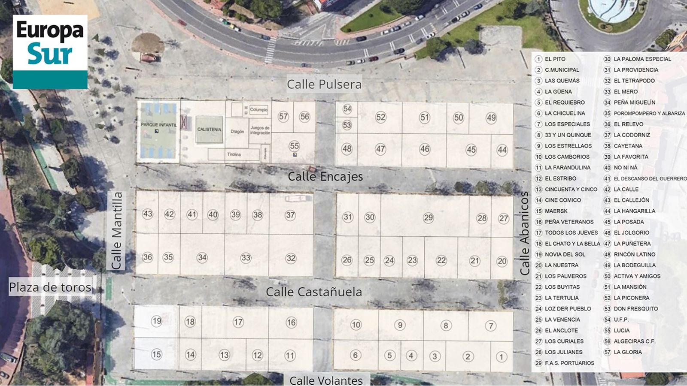

# 🛠️ Documentación Técnica del Código: Mapa Interactivo Feria de Algeciras 2026

**Versión:** 1.0  
**Fecha:** Mayo 2026  

---

## Índice

1. [Visión General del Flujo de Datos](#1-visión-general-del-flujo-de-datos)
2. [index.html — Estructura HTML](#2-indexhtml--estructura-html)
3. [style.css — Arquitectura de Estilos](#3-stylecss--arquitectura-de-estilos)
4. [script.js — Lógica de la Aplicación](#4-scriptjs--lógica-de-la-aplicación)
5. [firebase-config.js — Conexión con Firebase](#5-firebase-configjs--conexión-con-firebase)

---

## 1. Visión General del Flujo de Datos

```
[Usuario en móvil]
       │
       ▼
[index.html] carga los módulos:
       ├── style.css         → Aplica estilos visuales
       ├── firebase-config.js → Inicializa Firebase y exporta `db`
       └── script.js         → Importa `db`, gestiona toda la interactividad
              │
              ├── Escucha clics en .mapItem (SVG sobre el mapa)
              ├── Escucha el buscador (#manualSearch + #searchTrigger)
              └── Muestra el panel (#infoOverlay) con datos del elemento
```

---

## 2. `index.html` — Estructura HTML

El archivo `index.html` define la estructura semántica completa de la página. Usa etiquetas HTML5 semánticas para accesibilidad y SEO.

### Cabecera `<header class="mainHeader">`

```html
<header class="mainHeader" role="banner">
    <div class="headerContent">
        <div class="headerLeft">           <!-- Logo + texto del ayuntamiento -->
        <div class="headerRight">          <!-- Buscador + navegación -->
    </div>
</header>
```

| Clase / ID | Descripción |
|---|---|
| `.mainHeader` | Contenedor externo que aplica el padding y espaciado |
| `.headerContent` | Barra azul con gradiente institucional, bordes redondeados |
| `.headerLeft` | Flexbox horizontal con escudo y texto del ayuntamiento |
| `.headerShield` | Imagen del escudo/logo oficial |
| `.headerText` | Bloque con las dos líneas de texto "Ayuntamiento / de Algeciras" |
| `.headerRight` | Columna vertical con buscador y nav, alineada a la derecha |
| `.searchContainer` | Contenedor del input + botón de búsqueda |
| `#manualSearch` | Input de texto para buscar casetas (referenciado en `script.js`) |
| `#searchTrigger` | Botón "Buscar" que dispara la búsqueda (referenciado en `script.js`) |
| `.headerNav` | Barra de navegación con enlaces TEMAS / AYUNTAMIENTO / LA CIUDAD |

### Sección del Evento `<section class="eventTitleSection">`

```html
<section class="eventTitleSection">
    <h1 class="eventTitle">Feria Real de Algeciras 2026</h1>
</section>
```

- Contiene el único `<h1>` de la página (buena práctica SEO).
- Se muestra como una tarjeta blanca con sombra, separada de la cabecera.

### Mapa `<main class="mapWrapper">`

```html
<main class="mapWrapper">
    <div class="mapImageContainer">
        
        <svg id="eventMap" class="mapSvgOverlay">
            <rect ... class="mapItem" data-id="c1" data-name="..." />
        </svg>
    </div>
</main>
```

| Elemento | Descripción |
|---|---|
| `.mapWrapper` | Sección `<main>` con `flex: 1` para ocupar el espacio disponible entre cabecera y pie |
| `.mapImageContainer` | `position: relative` que sirve de base para superponer el SVG |
| `.mapImage` | Imagen real del mapa, `width: 100%` y `height: auto` para ser responsive |
| `#eventMap` / `.mapSvgOverlay` | SVG transparente superpuesto, `position: absolute` sobre la imagen |
| `.mapItem` | Cada elemento clicable dentro del SVG. Contiene `data-attributes` |

**`data-attributes` de cada `.mapItem`:**

| Atributo | Descripción |
|---|---|
| `data-id` | Identificador único de la caseta (ej. `c1`) |
| `data-name` | Nombre de la caseta (ej. `"Caseta Los Amigos"`) |
| `data-street` | Dirección o ubicación |
| `data-owner` | Propietario o entidad gestora |

### Panel de Detalle `<aside id="infoOverlay">`

```html
<aside id="infoOverlay" class="detailsOverlay" aria-hidden="true">
    <button id="closePanelBtn">×</button>
    <div class="detailsContent">
        <h2 id="displayName">...</h2>
        <p id="displayLocation">...</p>
        <div id="firebaseData"></div>
    </div>
</aside>
```

| ID | Descripción |
|---|---|
| `#infoOverlay` | Panel deslizante. Oculto por defecto (`transform: translateY(100%)`) |
| `#closePanelBtn` | Botón ✕ para cerrar el panel |
| `#displayName` | Texto donde se inyecta el nombre de la caseta seleccionada |
| `#displayLocation` | Texto donde se inyecta el identificador de la caseta |
| `#firebaseData` | Contenedor reservado para datos adicionales de Firebase |

### Pie de Página `<footer class="mainFooter">`

```html
<footer class="mainFooter">
    <div class="footerContent">
        <div class="footerLeft">
            
            <span class="footerHandle">ayuntamientoalgeciras</span>
        </div>
        <div class="footerRight">
            <span class="copyrightText">© Ayuntamiento de Algeciras</span>
        </div>
    </div>
</footer>
```

Siempre se muestra al final de la página gracias a `body { display: flex; flex-direction: column; min-height: 100vh; }` y `main { flex: 1; }`.

---

## 3. `style.css` — Arquitectura de Estilos

El archivo CSS está organizado en secciones lógicas:

### 3.1 Variables CSS (`:root`)

```css
:root {
    --primaryColor: #1a6abf;     /* Azul institucional */
    --secondaryColor: #003a7a;   /* Azul oscuro */
    --accentColor: #f0a500;      /* Dorado para elementos activos */
    --white: #ffffff;
    --lightGray: #f0f4f8;
    --textColor: #2c3e50;
    --shadow: 0 2px 8px rgba(0, 0, 0, 0.1);
}
```

Usar variables CSS facilita cambiar la paleta de colores en un solo lugar.

### 3.2 Reset y Base

```css
*, *::before, *::after { box-sizing: border-box; margin: 0; padding: 0; }
body {
    display: flex;
    flex-direction: column;
    min-height: 100vh;    /* Garantiza que el footer esté siempre abajo */
}
main.mapWrapper { flex: 1; } /* Ocupa el espacio sobrante */
```

### 3.3 Cabecera

La cabecera usa **Flexbox** en dirección fila (`flex-direction: row`) con dos hijos principales:
- `.headerLeft` (logo + texto): no se encoge (`flex-shrink: 0`)
- `.headerRight` (buscador + nav): ocupa el espacio restante (`flex: 1`)

La barra azul (`.headerContent`) tiene un gradiente horizontal y bordes redondeados de 12px.

### 3.4 Mapa

```css
.mapImageContainer { position: relative; }   /* Base para el posicionamiento */
.mapImage { width: 100%; height: auto; }     /* Imagen responsive */
.mapSvgOverlay {
    position: absolute;
    top: 0; left: 0;
    width: 100%; height: 100%;               /* SVG ocupa exactamente el mismo espacio que la imagen */
}
```

Las casetas (`.mapItem`) tienen transición suave en el color de relleno:
```css
.mapItem { fill: #eeeeee; transition: fill 0.3s ease; cursor: pointer; }
.mapItem:hover { fill: #bbdefb; }
.mapItem.active { fill: var(--accentColor); }  /* Dorado cuando está seleccionada */
```

### 3.5 Panel de Detalle

```css
.detailsOverlay {
    position: fixed;         /* Se fija a la ventana del navegador */
    bottom: 0;
    transform: translateY(100%);             /* Oculto fuera de la vista */
    transition: transform 0.4s cubic-bezier(0.175, 0.885, 0.32, 1.275);
}
.detailsOverlay.visible {
    transform: translateY(0);               /* Se desliza hacia arriba */
}
```

La transición usa una curva `cubic-bezier` con efecto "rebote" para una animación fluida y premium.

### 3.6 Media Queries (Responsive Design)

#### Móvil (`max-width: 600px`)
```css
@media (max-width: 600px) {
    .headerShield { height: 55px; }          /* Logo grande */
    .headerText { font-size: 0.7rem; }       /* Texto compacto */
    .searchInput, .searchBtn { font-size: 0.5rem; } /* Buscador micro */
    .headerNav { font-size: 0.45rem; }       /* Navegación ultra-pequeña */
}
```

#### Escritorio (`min-width: 768px`)
```css
@media (min-width: 768px) {
    .headerContent { padding: 10px 40px; height: 100px; }
    .eventTitleSection { padding: 20px 40px; }
    .mapWrapper { padding: 30px; }
}
```

---

## 4. `script.js` — Lógica de la Aplicación

### 4.1 Importaciones y Referencias al DOM

```javascript
import { db } from './firebase-config.js';   // Importa la instancia de Firestore

const manualSearchInput = document.getElementById('manualSearch');
const searchTriggerBtn  = document.getElementById('searchTrigger');
const mapItems          = document.querySelectorAll('.mapItem');
const infoOverlay       = document.getElementById('infoOverlay');
const closePanelBtn     = document.getElementById('closePanelBtn');
const displayName       = document.getElementById('displayName');
const displayLocation   = document.getElementById('displayLocation');
```

Todas las referencias al DOM se guardan en constantes al inicio para evitar consultas repetidas (mejor rendimiento).

### 4.2 Estado de la Aplicación

```javascript
const appState = {
    selectedItemId: null,   // ID de la caseta actualmente seleccionada
    isPanelVisible: false   // Si el panel de detalles está visible
};
```

Un objeto de estado centralizado facilita rastrear qué está pasando en la aplicación.

### 4.3 `updateDetailsPanel(element)` — Mostrar Información de una Caseta

```javascript
const updateDetailsPanel = (element) => {
    const itemName = element.dataset.name || "Sin nombre";
    const ownerId  = element.dataset.ownerId || "No disponible";

    displayName.textContent = itemName;
    displayLocation.textContent = `Identificador: ${ownerId}`;

    infoOverlay.classList.add('visible');           // Activa la animación de entrada
    infoOverlay.setAttribute('aria-hidden', 'false'); // Accesibilidad

    mapItems.forEach(item => item.classList.remove('active')); // Quita el estado activo de todo
    element.classList.add('active');                // Marca la caseta seleccionada en dorado
};
```

**Flujo:**
1. Lee los `data-attributes` del elemento SVG clickeado.
2. Inyecta el texto en el panel de información.
3. Añade la clase `.visible` al panel → CSS activa la animación de deslizamiento.
4. Resalta visualmente la caseta seleccionada en el mapa.

### 4.4 `executeManualSearch()` — Búsqueda por Nombre

```javascript
const executeManualSearch = () => {
    const query = manualSearchInput.value.toLowerCase().trim();
    if (!query) return;                    // No hace nada si el input está vacío

    let foundItem = null;
    mapItems.forEach(item => {
        const itemName = (item.dataset.name || "").toLowerCase();
        if (itemName.includes(query)) {
            foundItem = item;              // Guarda el primer elemento que coincide
        }
    });

    if (foundItem) {
        updateDetailsPanel(foundItem);
        foundItem.scrollIntoView({ behavior: 'smooth', block: 'center' }); // Desplaza al elemento
    } else {
        alert("No se encontró ninguna caseta con ese nombre.");
    }
};
```

La búsqueda es **insensible a mayúsculas** y busca coincidencias parciales (si escribes "amig" encontrará "Caseta Los Amigos").

### 4.5 `closeDetailsPanel()` — Cerrar el Panel

```javascript
const closeDetailsPanel = () => {
    infoOverlay.classList.remove('visible');         // Dispara la animación de salida
    infoOverlay.setAttribute('aria-hidden', 'true');
    mapItems.forEach(item => item.classList.remove('active')); // Quita el resaltado del mapa
};
```

### 4.6 Event Listeners (Escuchadores de Eventos)

| Evento | Elemento | Acción |
|---|---|---|
| `click` | `#searchTrigger` | Ejecuta `executeManualSearch()` |
| `keypress` (Enter) | `#manualSearch` | Ejecuta `executeManualSearch()` |
| `click` | Cada `.mapItem` | Llama a `updateDetailsPanel(item)` |
| `keypress` (Enter) | Cada `.mapItem` | Llama a `updateDetailsPanel(item)` (accesibilidad) |
| `click` | `#closePanelBtn` | Llama a `closeDetailsPanel()` |

### 4.7 Inicialización

```javascript
document.addEventListener('DOMContentLoaded', () => {
    initializeAppPersistence(); // Confirma en consola que Firebase está listo
});
```

---

## 5. `firebase-config.js` — Conexión con Firebase

```javascript
import { initializeApp }  from "firebase-app.js";
import { getAnalytics }   from "firebase-analytics.js";
import { getFirestore }   from "firebase-firestore.js";
import { getAuth }        from "firebase-auth.js";

const firebaseConfig = {
    apiKey:            "...",
    authDomain:        "eventos-ayuntamiento.firebaseapp.com",
    projectId:         "eventos-ayuntamiento",
    storageBucket:     "eventos-ayuntamiento.firebasestorage.app",
    messagingSenderId: "375769854696",
    appId:             "1:375769854696:web:...",
    measurementId:     "G-NV58CQT7BT"
};

const app       = initializeApp(firebaseConfig);
const analytics = getAnalytics(app);   // Análisis de uso
const db        = getFirestore(app);   // Base de datos principal
const auth      = getAuth(app);        // Autenticación (para uso futuro)

export { app, analytics, db, auth };   // Se exportan para uso en otros módulos
```

### Servicios Inicializados

| Servicio | Variable exportada | Uso actual |
|---|---|---|
| Firebase App | `app` | Base de toda la conexión |
| Firestore | `db` | Leer datos de casetas (preparado) |
| Analytics | `analytics` | Registro de eventos de usuario |
| Auth | `auth` | Autenticación (preparada, sin uso activo aún) |

> **⚠️ Seguridad:** Las `apiKey` de Firebase en aplicaciones web son públicas por diseño. La seguridad real se gestiona mediante **Firebase Security Rules** en el panel de Firebase Console, que restringen quién puede leer/escribir en la base de datos.

---

## 6. Diagrama de Flujo de Interacción

```
[Usuario hace clic en caseta del SVG]
           │
           ▼
[addEventListener 'click' en .mapItem]
           │
           ▼
[updateDetailsPanel(element)]
    ├── Lee data-name y data-ownerId del elemento SVG
    ├── Inyecta texto en #displayName y #displayLocation
    ├── Añade clase .visible a #infoOverlay → CSS anima el panel hacia arriba
    └── Añade clase .active al elemento → CSS lo colorea en dorado

[Usuario pulsa ✕ o fuera del panel]
           │
           ▼
[closeDetailsPanel()]
    ├── Quita clase .visible → CSS anima el panel hacia abajo (desaparece)
    └── Quita clase .active de todos los .mapItem

[Usuario escribe en el buscador y pulsa Enter o "Buscar"]
           │
           ▼
[executeManualSearch()]
    ├── Recoge texto del input (en minúsculas)
    ├── Itera sobre todos los .mapItem buscando coincidencia en data-name
    ├── Si encuentra → llama a updateDetailsPanel() + scrollIntoView()
    └── Si no encuentra → muestra alert()
```

---

*Documento técnico generado para el proyecto Mapa Interactivo Feria Real de Algeciras 2026.*  
*Ayuntamiento de Algeciras — Área de Innovación y Tecnología*
